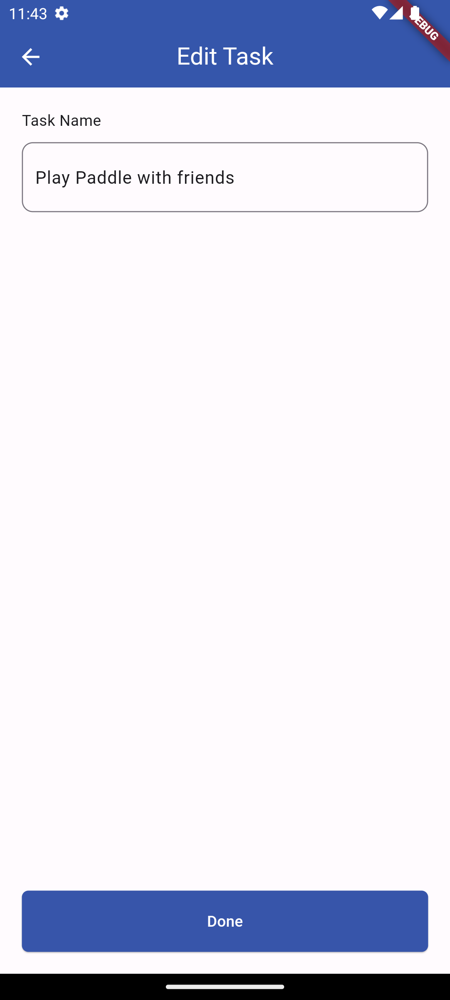
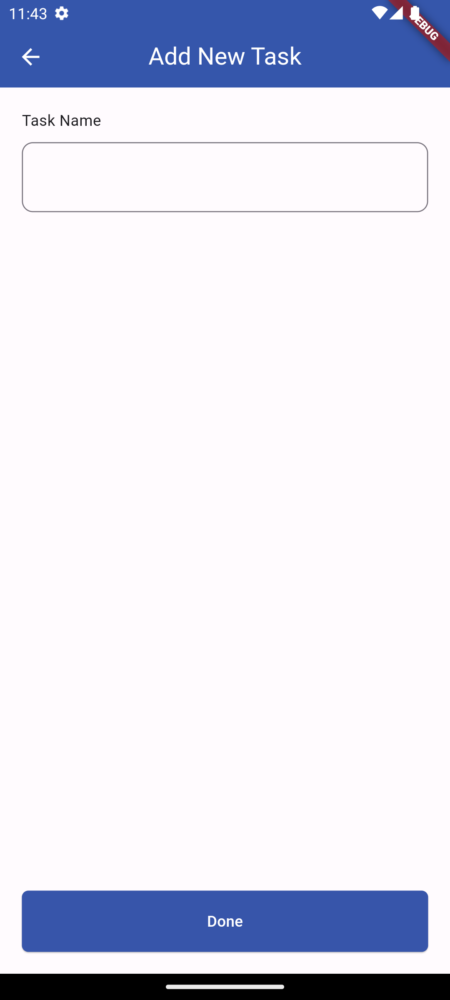

# flutter_todo

Flutter Todo app created according to the Figma design.

## Screenshots

<table>
  <tr>
    <td>
Todo Screen
</td>
    <td>
Edit Screen
</td>
    <td>
Add New Task Screen
</td>
  </tr>
  <tr>
    

    <td></td>
    <td></td>
    <td></td>
    

  </tr>
  <tr>
    <td>
Added Task
</td>
    <td>
Todo Performed
</td>
    <td>
Completed Task
</td>
  </tr>
  <tr>
    <td></td>
    <td></td>
    <td></td>
  </tr>
 </table>
